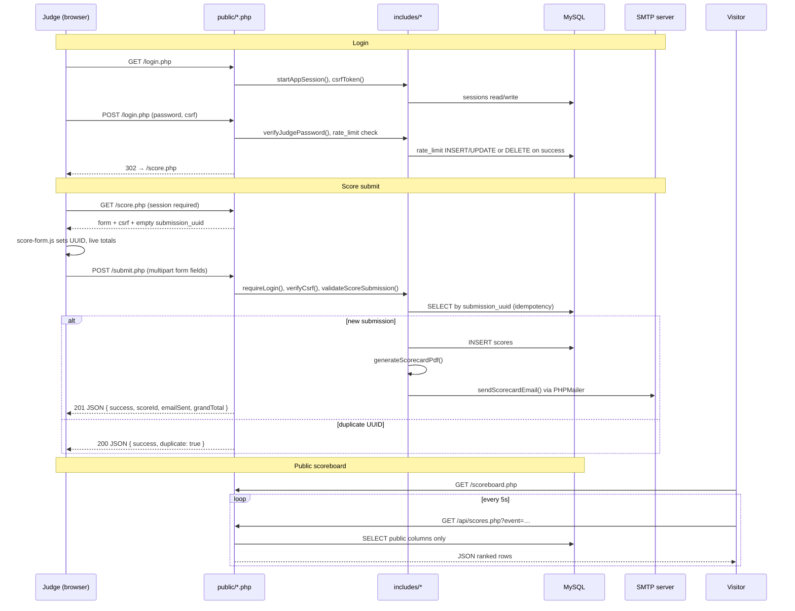

# Florida Sound Quality — Scoring Web App

Architecture and implementation plan for the original MVP (shared judge password, auto-email on submit).

**Superseded for product auth/flows:** the app now uses role-based `users` (`admin` / `judge`), open competitor registration at `/competitor.php`, judge scoring against registered competitors, and **manual** admin scorecard email. Prefer `README.md` + `schema.sql` for current behavior. This document remains useful for scoring field ranges, Railway session notes, and Dompdf/email plumbing history.

---

**Stack:** plain PHP (no framework), MySQL, vanilla HTML/CSS/JS (no React/Vue/build step). Deploy target: **Railway** (Nixpacks + Heroku PHP buildpack) with the MySQL plugin. Composer pulls PHP libraries only (PHPMailer, Dompdf).

---

## 1. Architecture

### 1.1 Goals

| ID | Goal |
|----|------|
| **G1** | Judges can score quickly on a phone — large tap targets, live subtotals, minimal typing. |
| **G2** | Every submission is stored reliably in MySQL with server-side validation and recalculated totals. |
| **G3** | Competitors receive a PDF scorecard by email after submit (best-effort; save succeeds even if mail fails). |
| **G4** | Public visitors see a live scoreboard filtered by event, ranked by grand total (max 230). |
| **G5** | Simple deploy: upload / git-push tree, `composer install`, point docroot at `public/`, import schema — no frontend compile step. |

### 1.2 Assumptions

- **Hosting:** Railway project with a **MySQL plugin** and a **web** service. TLS terminates at Railway’s edge; internal traffic is HTTP.
- **Runtime:** PHP **≥ 8.0** with `pdo_mysql`, `mbstring`, `openssl`, `json`.
- **Database config:** Railway injects discrete env vars — `MYSQLHOST`, `MYSQLPORT`, `MYSQLUSER`, `MYSQLPASSWORD`, `MYSQLDATABASE` — referenced into the web service via `${{MySQL.*}}` syntax. Local dev uses the same names in `.env`.
- **Auth:** Single shared judge password stored as **bcrypt hash** in `JUDGE_PASSWORD_HASH` (never in source or HTML).
- **Email (Phase 4+):** SMTP credentials in env (`SMTP_*`, `MAIL_FROM*`). Mailtrap or similar for dev.
- **Events:** Free-text `event_name` on each score row — no admin CRUD, no separate events table for v1.
- **Judges:** Multiple judges may score the same competitor at the same event; no uniqueness on `(competitor, event)`.

### 1.3 Constraints

| Constraint | Rationale / handling |
|------------|----------------------|
| Assignment spec §8 — deploy by file upload | No webpack/vite; only `composer install` for PHP deps. |
| No PHP framework | Keep surface area small; `includes/` + page scripts. |
| `includes/` must not be web-accessible | Document root = `public/` only; Apache/Nixpacks + local `router.php`. |
| Grand total max **230** | Tonal 100 + stage 65 + imaging 50 + noise/listening 15; enforce ranges server-side. |
| Mobile-first UX | Custom **steppers** (− / value / +), not native `<input type="number">` spinners. |
| Railway container redeploys | **DB-backed sessions** (`sessions` table), not file-based `/tmp` sessions. |
| HTTPS behind proxy | Cookie `secure` flag via `X-Forwarded-Proto: https`, not `$_SERVER['HTTPS']`. |
| Login brute-force | **5 failed attempts / 15 minutes** per IP (`rate_limit` table). |
| Idempotent submit | Client-generated UUID v4 per form load; `UNIQUE(submission_uuid)` + duplicate handling. |
| Scoreboard privacy | API never returns email, notes, or judge name. |

### 1.4 Components / modules

```
Florida_Sound_Quality/
├── public/                    ← HTTP document root (only tree served)
│   ├── index.php              redirect → login or score
│   ├── login.php              judge login (POST + CSRF + rate limit)
│   ├── logout.php             destroy session
│   ├── score.php              protected scoring form
│   ├── submit.php             POST JSON API — validate, insert, PDF, email
│   ├── scoreboard.php         public standings page
│   ├── api/
│   │   └── scores.php         public JSON — events list + ranked scores
│   ├── css/
│   │   └── style.css          global styles (Phase 3)
│   └── js/
│       ├── score-form.js        steppers, totals, fetch submit
│       └── scoreboard.js        5s polling
├── includes/                  ← NOT web-accessible
│   ├── config.php             env, DB constants, HTTPS helper, rate-limit constants
│   ├── db.php                 PDO singleton + query helpers
│   ├── auth.php               DB session handler, login, CSRF, rate limit
│   ├── validation.php         score field defs + server validation/totals
│   ├── pdf.php                Dompdf scorecard HTML → PDF bytes
│   └── email.php              PHPMailer wrapper
├── schema.sql                 scores, rate_limit, sessions
├── seed.sql                   demo rows (Phase 6)
├── composer.json              php ≥8, phpmailer, dompdf
├── Procfile                   web: vendor/bin/heroku-php-apache2 public/
├── railway.json               Nixpacks + startCommand mirror Procfile
├── router.php                 local dev front controller (docroot isolation)
├── .env.example
└── README.md                  setup + deploy notes (Phase 6)
```

### 1.5 Data flow



### 1.6 API contracts

#### `POST /login.php`

- **Auth:** none (public).
- **Body:** `application/x-www-form-urlencoded` — `csrf_token`, `password`.
- **Success:** `302 Location: /score.php`, session cookie `FSQSESSID` (HttpOnly, SameSite=Strict, Secure when HTTPS).
- **Failure:** `200` HTML with error message; after 5 failures in 15 min → lockout message.

#### `POST /submit.php`

- **Auth:** judge session required.
- **Body:** form fields mirroring `score.php` (see schema). Includes `csrf_token`, `submission_uuid` (UUID v4).
- **Responses (JSON):**

| Status | Body |
|--------|------|
| `201` | `{ "success": true, "scoreId": N, "emailSent": bool, "grandTotal": N, "emailWarning"?: "Score saved, email failed." }` |
| `200` | `{ "success": true, "scoreId": N, "duplicate": true, "emailSent": false, "grandTotal": N }` |
| `403` | `{ "success": false, "errors": { "_form": "Invalid CSRF token." } }` |
| `422` | `{ "success": false, "errors": { "<field>": "<message>", … } }` |
| `405` | method not POST |

- **Totals:** server recalculates `tonal_total`, `stage_total`, `grand_total` — client values ignored.

#### `GET /api/scores.php`

- **Auth:** none (public).
- **Query params:**
  - `action=events` → `{ "events": ["…"], "default": "…" }` (distinct event names, latest first).
  - `event=<name>` → JSON array of rows (empty array if unknown/no data):

```json
[
  {
    "rank": 1,
    "competitor_name": "Jane Doe",
    "vehicle_year": 2022,
    "vehicle_make": "Honda",
    "vehicle_model": "Civic",
    "total_score": 194,
    "placement": "1st"
  }
]
```

- **Never includes:** `competitor_email`, `judge_name`, any `*_notes` fields.

### 1.7 Database schema

```sql
-- Florida Sound Quality — scoring app schema
-- MySQL 5.7+ / Railway MySQL
-- Import once: mysql < schema.sql   or   railway connect MySQL < schema.sql

CREATE TABLE IF NOT EXISTS scores (
    id               INT UNSIGNED AUTO_INCREMENT PRIMARY KEY,
    submission_uuid  CHAR(36)         NOT NULL,
    -- header
    event_date       DATE             NOT NULL,
    event_name       VARCHAR(255)     NOT NULL,
    judge_name       VARCHAR(255)     NOT NULL,
    competitor_name  VARCHAR(255)     NOT NULL,
    competitor_email VARCHAR(255)     NOT NULL,
    -- vehicle
    vehicle_year     SMALLINT UNSIGNED,
    vehicle_make     VARCHAR(100),
    vehicle_model    VARCHAR(100),
    vehicle_color    VARCHAR(50),
    -- tonal accuracy (each 1–20)
    sub_bass         TINYINT UNSIGNED NOT NULL,
    mid_bass         TINYINT UNSIGNED NOT NULL,
    midrange         TINYINT UNSIGNED NOT NULL,
    high_freq        TINYINT UNSIGNED NOT NULL,
    spectral_balance TINYINT UNSIGNED NOT NULL,
    tonal_notes      TEXT,
    -- sound stage
    listening_position TINYINT UNSIGNED NOT NULL,
    width            TINYINT UNSIGNED NOT NULL,
    height           TINYINT UNSIGNED NOT NULL,
    depth            TINYINT UNSIGNED NOT NULL,
    ambience         TINYINT UNSIGNED NOT NULL,
    stage_notes      TEXT,
    -- imaging
    imaging_score    TINYINT UNSIGNED NOT NULL,
    imaging_notes    TEXT,
    -- noise & listening
    noise            TINYINT UNSIGNED NOT NULL,
    listening_pleasure TINYINT UNSIGNED NOT NULL,
    noise_notes      TEXT,
    listening_notes  TEXT,
    -- calculated (server-side)
    tonal_total      TINYINT UNSIGNED NOT NULL,
    stage_total      TINYINT UNSIGNED NOT NULL,
    grand_total      SMALLINT UNSIGNED NOT NULL,
    -- placement
    placement        VARCHAR(100),
    -- optional photo/scan of the original paper scoring sheet (S3 object key)
    paper_sheet_key  VARCHAR(512)     NULL,
    -- meta
    created_at       TIMESTAMP DEFAULT CURRENT_TIMESTAMP,

    UNIQUE KEY uq_submission (submission_uuid),
    INDEX idx_event (event_name),
    INDEX idx_total (grand_total DESC)
) ENGINE=InnoDB DEFAULT CHARSET=utf8mb4;

CREATE TABLE IF NOT EXISTS rate_limit (
    ip_address   VARCHAR(45) PRIMARY KEY,
    attempts     TINYINT UNSIGNED NOT NULL DEFAULT 0,
    last_attempt TIMESTAMP DEFAULT CURRENT_TIMESTAMP ON UPDATE CURRENT_TIMESTAMP
) ENGINE=InnoDB DEFAULT CHARSET=utf8mb4;

-- DB-backed sessions so they survive Railway container redeploys
CREATE TABLE IF NOT EXISTS sessions (
    id          VARCHAR(128) PRIMARY KEY,
    data        MEDIUMBLOB   NOT NULL,
    last_access INT UNSIGNED NOT NULL,
    INDEX idx_last_access (last_access)
) ENGINE=InnoDB DEFAULT CHARSET=utf8mb4;
```

**Score field ranges (enforced in `validation.php`):**

| Section | Fields | Range each | Section max |
|---------|--------|------------|-------------|
| Tonal | sub_bass, mid_bass, midrange, high_freq, spectral_balance | 1–20 | 100 |
| Stage | listening_position, width, height | 1–15 | |
| Stage | depth, ambience | 1–10 | 65 |
| Imaging | imaging_score | 1–50 | 50 |
| Noise | noise | 1–5 | |
| Listening | listening_pleasure | 1–10 | 15 |
| **Grand total** | | | **230** |

### 1.8 Dependencies

| Package | Version | Purpose |
|---------|---------|---------|
| `php` | ≥ 8.0 | Runtime |
| `phpmailer/phpmailer` | ^6.9 | SMTP email with PDF attachment |
| `dompdf/dompdf` | ^3.0 | HTML → PDF scorecard |

Install: `composer install --no-dev`. Vendor dir is gitignored; Railway/Nixpacks runs composer during build.

**Procfile:**

```
web: vendor/bin/heroku-php-apache2 public/
```

### 1.9 Risks

| Risk | Likelihood | Impact | Mitigation |
|------|------------|--------|------------|
| Railway redeploy drops file sessions | High (if used) | Judges logged out mid-event | DB session handler (`sessions` table) |
| Double submit on flaky mobile network | Medium | Duplicate rows | UUID idempotency + UNIQUE constraint |
| SMTP failure at event | Medium | No email | Save first; return `emailWarning`; judge sees success |
| `includes/` accidentally exposed | Low | Credential leak | Docroot = `public/` only; verify 404 locally via `router.php` |
| Client tampered totals | Medium | Wrong standings | Server-only total calculation |
| Login brute force | Low | Unauthorized scoring | Rate limit 5 / 15 min per IP |
| Scoreboard leaks PII | Medium | Privacy violation | Explicit column list in API query |
| Dompdf font/layout issues | Low | Ugly PDF | DejaVu Sans bundled; simple HTML template |
| HTTPS cookie not marked Secure | Medium | Session hijack | `isHttps()` checks `X-Forwarded-Proto` |

---

## 2. Implementation plan

Phases are sequential; each ends with a working, testable increment. Commit after each phase before starting the next.

### Phase 1 — Project Skeleton, Railway Config & Database

**Objective:** Bootable PHP app with auth, schema, and Railway wiring — no scoring form yet.

**Tasks**

1. Create directory layout: `public/`, `includes/`, `public/api/`, `public/css/`, `public/js/`.
2. Add `composer.json`, `.gitignore`, `.env.example`, `Procfile`, `railway.json`.
3. Write `schema.sql` (scores, rate_limit, sessions) and import locally + Railway MySQL.
4. Implement `includes/config.php` — load `.env`, read `MYSQL*` vars, `JUDGE_PASSWORD_HASH`, SMTP placeholders, `isHttps()`, rate-limit constants.
5. Implement `includes/db.php` — PDO singleton, prepared-statement helpers.
6. Implement `includes/auth.php` — `DbSessionHandler`, `requireLogin()`, bcrypt verify, CSRF, rate limit (5 / 900s), `clientIp()` with `X-Forwarded-For`.
7. Build `public/index.php`, `login.php`, `logout.php`, stub `score.php`.
8. Minimal `public/css/style.css` for login (full design in Phase 3).
9. Add `router.php` for local dev: `php -S 127.0.0.1:8000 -t public router.php`.
10. Provision Railway: MySQL plugin + web service; wire `${{MySQL.*}}` refs and `JUDGE_PASSWORD_HASH`.

**Deliverables**

- `schema.sql`, skeleton PHP files, Railway project linked, schema imported.

**Acceptance criteria**

- [ ] `GET /includes/config.php` → **404** (not reachable).
- [ ] Login page renders; password hash never appears in HTML/JS.
- [ ] Correct password → redirect to `score.php`; session row in `sessions` table.
- [ ] Wrong password 5× → lockout message; row in `rate_limit`.
- [ ] Session survives PHP process restart (DB persistence).
- [ ] CSRF token present on login form; invalid token rejected.

---

### Phase 2 — Scoring Form (Frontend + Server Validation)

**Objective:** Full mobile scoring UI with server-validated submit.

**Tasks**

1. `includes/validation.php` — `scoreFieldDefs()`, `validateScoreSubmission()` with all ranges and server-side totals.
2. `public/score.php` — sections: Event & Competitor, Vehicle, Tonal, Stage, Imaging, Noise & Listening; `renderStepper()` helper; hidden `submission_uuid` + CSRF.
3. `public/js/score-form.js` — UUID v4 on load (regenerate after successful submit), stepper buttons, live subtotals/grand total, `fetch` POST to `/submit.php`, inline field errors from 422 JSON.
4. `public/submit.php` — require login + CSRF; validate; idempotent insert by `submission_uuid`; JSON responses per API contract.

**Deliverables**

- Working end-to-end score entry and persistence (no email/PDF yet).

**Acceptance criteria**

- [ ] All score fields enforce min/max client- and server-side.
- [ ] Grand total displays live; matches server calculation on submit.
- [ ] Valid submit → `201` + `scoreId`; row in `scores`.
- [ ] Duplicate UUID → `200` + `duplicate: true`; no second row.
- [ ] Out-of-range value → `422` with field errors.
- [ ] Bad CSRF → `403`.
- [ ] Unauthenticated POST → redirect / reject.

---

### Phase 3 — Visual Design & Polish

**Objective:** Assignment-matching look — dark charcoal, warm amber, Barlow typography, no decorative borders.

**Tasks**

1. Expand `public/css/style.css` — CSS variables, app header, login panel, score sections, steppers (large tap targets), grand-total bar, form status states.
2. Update `login.php` and `score.php` markup/classes; add Google Fonts (Barlow / Barlow Semi Condensed).
3. Ensure separation via background tone shifts and spacing — **no** `border` on containers/cards/inputs (focus via inset box-shadow only).
4. Top-3 scoreboard styling hooks (`.rank-1`, etc.) — used in Phase 5.

**Deliverables**

- Polished mobile-first UI on login + score pages.

**Acceptance criteria**

- [ ] Readable on ~375px viewport; stepper buttons ≥ 3.25rem tap height.
- [ ] No decorative borders on sections/inputs (grep `border` in CSS — only focus shadows if any).
- [ ] Typography uses Barlow family; dark bg `#1a1a1a`, accent `#c45c26`.
- [ ] Live totals visually prominent (large accent numerals).

---

### Phase 4 — Email + PDF Scorecard

**Objective:** After successful insert, generate PDF and email to competitor.

**Tasks**

1. `includes/pdf.php` — `buildScorecardHtml()`, `generateScorecardPdf()` via Dompdf (DejaVu Sans, letter portrait).
2. `includes/email.php` — `sendScorecardEmail()` via PHPMailer (SMTP from env); attach PDF; plain-text body with event + grand total.
3. Extend `submit.php` — after INSERT: generate PDF → send mail; catch errors; set `emailSent` / `emailWarning`.
4. Document SMTP vars in `.env.example`.

**Deliverables**

- PDF scorecard emailed on submit when SMTP configured.

**Acceptance criteria**

- [ ] With valid SMTP: competitor receives PDF attachment; `emailSent: true`.
- [ ] With missing/bad SMTP: score still saved; response includes `emailWarning: "Score saved, email failed."`
- [ ] Duplicate submit does not re-send email.
- [ ] PDF shows all score sections, subtotals, grand total / 230, event/competitor/vehicle metadata.

---

### Phase 5 — Public Scoreboard

**Objective:** Unauthenticated live standings by event.

**Tasks**

1. `public/api/scores.php` — `action=events` + `event=` handlers; ranked by `grand_total DESC, id ASC`; public column set only.
2. `public/scoreboard.php` — event `<select>`, empty state, link to judge login.
3. `public/js/scoreboard.js` — load events, poll scores every **5 seconds**, render list with rank / name / vehicle / total / placement.

**Deliverables**

- `/scoreboard.php` + `/api/scores.php`.

**Acceptance criteria**

- [ ] No login required for scoreboard or API.
- [ ] API response keys: `rank`, `competitor_name`, `vehicle_*`, `total_score`, `placement` only.
- [ ] Grep API output — no `email`, `judge`, `notes`.
- [ ] Event filter switches standings; default = most recent event.
- [ ] Page updates within 5s of new submit (polling).

---

### Phase 6 — Seed Data, README, Final QA

**Objective:** Demo data, operator documentation, end-to-end verification.

**Tasks**

1. `seed.sql` — ≥ 6 rows across 2 events with realistic scores; `INSERT IGNORE` + fixed UUIDs for safe re-run.
2. `README.md` — local quick start, Railway deploy steps, SMTP setup, security notes, project layout, AI-usage note.
3. Final QA checklist: lint all PHP; smoke login/submit/scoreboard; import seed on local + Railway; verify docroot isolation.

**Deliverables**

- `seed.sql`, `README.md`, QA sign-off.

**Acceptance criteria**

- [ ] `mysql < seed.sql` → 6 rows; scoreboard shows Tampa + Orlando events.
- [ ] README documents `php -S … router.php`, test password generation, Railway variable wiring.
- [ ] All PHP files pass `php -l`.
- [ ] Full flow: login → score → submit → scoreboard reflects new total.
- [ ] Assignment PDF requirements cross-checked (mobile form, email PDF, public board, PHP/MySQL, deploy notes).

---

## 3. Open questions (resolved)

| ID | Question | Resolution |
|----|----------|------------|
| **Q1** | Where to host? | **Railway** — managed MySQL, HTTPS, git deploy. Same tree works on any PHP host via FTP (docroot `public/`). |
| **Q2** | Separate `events` table? | **No** — `event_name VARCHAR` on `scores`. No FK/admin CRUD needed for v1. |
| **Q3** | Session storage? | **MySQL `sessions` table** — survives Railway redeploys and scales to multiple replicas. |
| **Q4** | Judge accounts vs shared password? | **Single shared password** — bcrypt hash in env. Suitable for small trusted judge pool. |
| **Q5** | Login rate-limit policy? | **5 failures / 15 minutes** per IP in `rate_limit` table. |
| **Q6** | Duplicate submit on retry? | **UUID v4** per form load; `UNIQUE(submission_uuid)`; API returns success with `duplicate: true`. |
| **Q7** | Number input UI? | **Custom steppers** (− / text / +), not native number spinners — better on mobile, no accidental scroll changes. |
| **Q8** | Email fails after save? | **Score persists**; judge sees success + `"Score saved, email failed."` |
| **Q9** | PDF generation? | **Dompdf** server-side from HTML template — no external API. |
| **Q10** | Scoreboard refresh? | **Poll every 5 seconds** via `fetch` — simple, no WebSocket infra. |
| **Q11** | Scoreboard data exposure? | **Public columns only** — never email, notes, or judge name. |
| **Q12** | Trust client totals? | **Never** — server recalculates all totals in `validateScoreSubmission()`. |
| **Q13** | Local `php -S` docroot? | **`router.php` + `-t public`** — mirrors Apache; blocks `includes/`. |
| **Q14** | Composer scope? | **PHPMailer + Dompdf only** — no frontend build tooling; satisfies §8 no-transpile deploy. |

---

*Document version: 1.0 — aligned with implemented codebase (Phases 1–6).*
